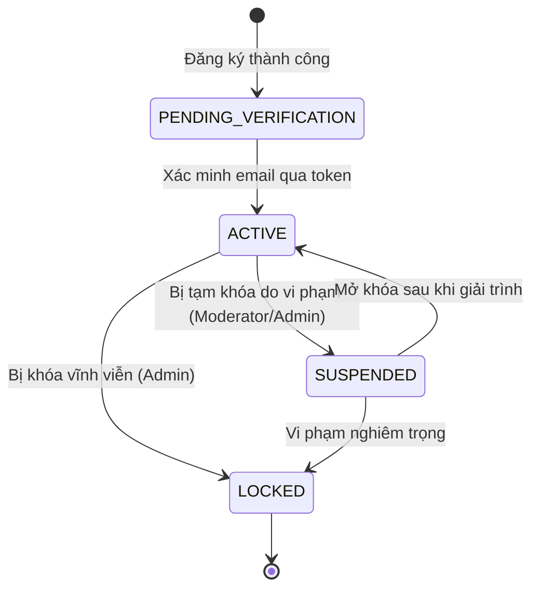
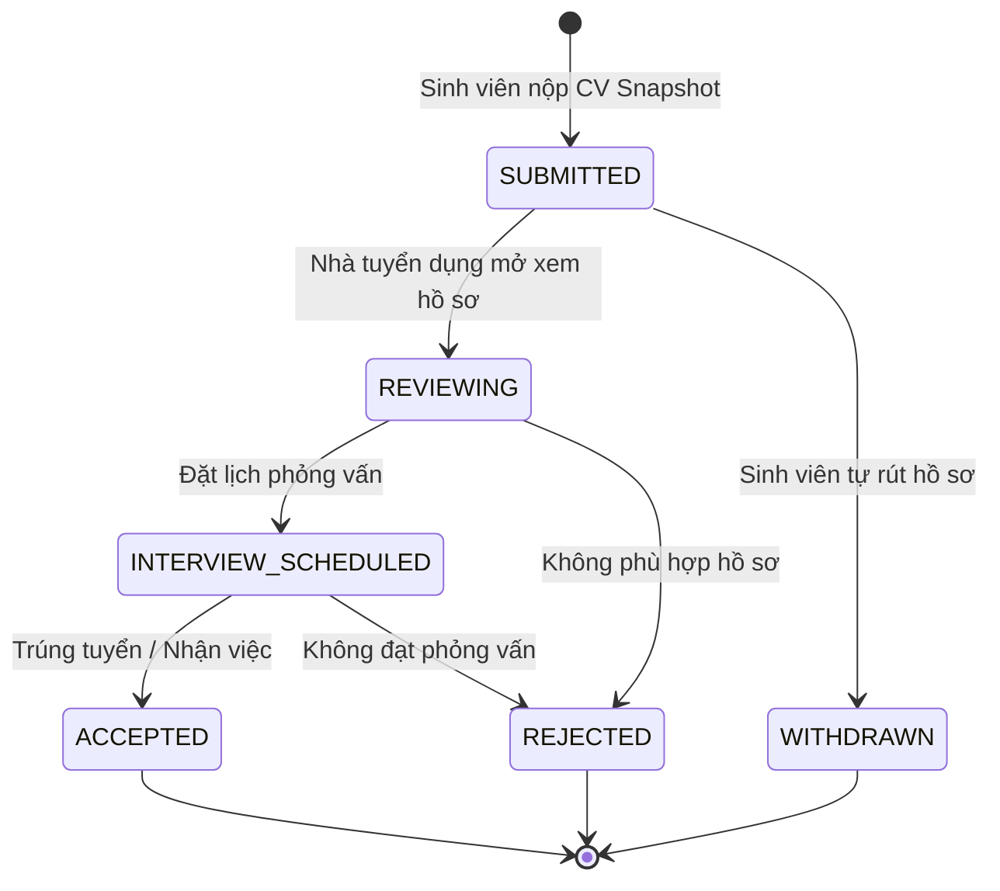
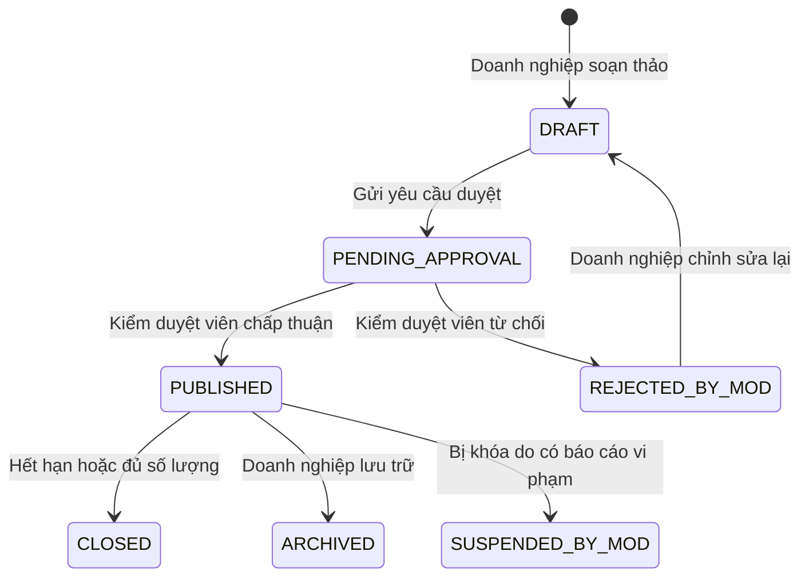

# CAMPUSJOB — VAI TRÒ VÀ MÁY TRẠNG THÁI (ROLES & STATE MACHINES)

## I. CÁC VAI TRÒ HỆ THỐNG (SYSTEM ROLES)

| Vai trò (Role) | Mô tả | Quyền hạn chính |
|---|---|---|
| `STUDENT` | Sinh viên đang theo học hoặc mới tốt nghiệp | Tìm kiếm việc làm, quản lý CV cá nhân, xác thực email trường, ứng tuyển, quản lý lịch phỏng vấn, đánh giá công ty. |
| `EMPLOYER` | Nhà tuyển dụng, đại diện pháp lý của doanh nghiệp | Quản lý thông tin công ty, chi nhánh, đăng tin tuyển dụng, xem CV snapshot của ứng viên, cập nhật trạng thái ứng tuyển, lên lịch phỏng vấn. |
| `MODERATOR` | Kiểm duyệt viên (Ban cán sự trường / Quản trị nội dung) | Thẩm định và duyệt hồ sơ doanh nghiệp mới, duyệt tin tuyển dụng trước khi công khai, xử lý báo cáo vi phạm từ người dùng. |
| `ADMIN` | Quản trị viên cấp cao nhất | Toàn quyền kiểm soát hệ thống, quản lý người dùng, phân quyền, xem audit log, kích hoạt chế độ bảo trì, cấu hình thông số. |

---

## II. MÁY TRẠNG THÁI (STATE MACHINES)

### 1. Trạng thái người dùng (`UserStatus`)

### 2. Trạng thái hồ sơ ứng tuyển (`ApplicationStatus`)

### 3. Trạng thái tin tuyển dụng (`JobStatus`)

